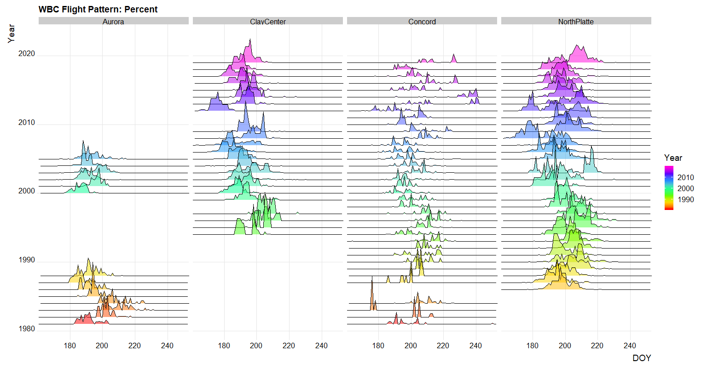

```{r, include = F, eval = T}
knitr::opts_chunk$set(echo=F, dpi=300, eval = FALSE)
library(tidyverse)
```

class:primary
## Outline

- CASNR Data: Student Success

- Visual Inference

- Future Thoughts

- Brainstorming & Collaboration Discussion

- Progress Report & Program of Studies

---
class:primary
## Student Success

- Met with Dr. Tiffany Heng-Moss (Dean of CASNR)

- Sense of Belonging:
  - Sense of belonging: A sense of belonging is “a basic human need and motivation, sufficient to influence behavior. In terms of college, sense of belonging refers to students’ perceived social support on campus, a feeling or sensation of connectedness, the experience of mattering or feeling cared about, accepted, respected, valued by, and important to the group (e.g., campus community) or others on campus (e.g., faculty, peers).” (Strayhorn, 2012, p. 3)
  - There are many reasons that sense of belonging matters within higher education. Two key areas are retention and persistence and mental health.
  - Do first-year students experience peer belonging and institutional acceptance differently by socio-demographic student characteristics (race or ethnicity, parental education, or gender)?
  - Are students’ sense of peer belonging and institutional acceptance positively accepted by first-year participation in HIPs (research with faculty, service learning, learning community, and student leadership)?
  
- Matriculation Success (i.e. time to graduation)

- Retention Rates

---
class:primary
## P.O.W.E.R Survey

- P.O.W.E.R Survey (Purpose, Ownership, Wellness, Engagement, Relationships)
  - Sent to all UNL Freshman in the fourth week of the Fall 2019 semeseter (1788 responses, 38.3% response rate)
  - 11 Binary Questions 
  - Outreach to Res Life, Student Inolvement, Big Red Resilience, Office of Academic Success & intercultural Services (OASIS), First-Year Experience and Transition Programs (FYETP), Husker Hub, University Advising

.center[
  
]
---
class:primary
## Student Demographic Data
- Academic Management Information System (AMIS Database) [https://iea.unl.edu/]
  - Snapshot of UNL's data taken each semeseter (Fall, Spring, Summer)
  - VARIABLES GO HERE
  
- National Survey of Student Engagement (NSSE) Survey [http://nsse.indiana.edu/]
  - Five levels: Level of academic challenge, active and collaborative learning, student-faculty interaction, enriching educational experiences, and supportive campus environment.
  - UNL participated in the NSSE in 2007, 2010, 2011 (Pilot study), 2012 (Pilot study), 2013, 2016 [response rate: 27% for freshman & 23% for seniors), and 2019 [HIP’s, Inclusiveness and Engagement with Cultural Diversity, Association of American Universities Data Exchange - AAUDE] (https://www.unl.edu/nsse/) 

---
class:primary
## Past Studies & Overarching Themes
- Strayhorn (2012) developed a model for sense of belonging within higher education that is similar to Maslow’s hierarchy of needs.

- Astin’s (1991) input-environment-outcome (I-E-O) model: inputs should describe qualities of the student prior to being exposed to the college environment and exposure to the environment is known to precede the assessment of the outcome performance.
- A students’ sense of belonging declines over the course of an academic year.
- Race / Ethnicity are important predictors.
- First Generation students are impacted.
- Student involvement / High Impact Practices.

---
class:primary
## Introduction to Visual Inference

---
class:primary
## Future Thoughts
- I have found that I enjoy spending my time on:
  - Experimental Design
  - Communicating Statistics (e.g. Consulting and Teaching)
  - Data Science
  - Nonlinear Analysis
  - Structural Equation Modleing (SEM)
  
- Concerns I have about the Student Sense of Belonging:
  - Reliability & validity of survey.
  - The survey is binary.
  - The questions target different aspects of a student's sense of belonging, can we tie them all together with psychometrics to come up with one measure?
  
- Possible directions:
  - Combine visual inference and survey data (item response theroy - IRT).
  - Detecting bias due to missing data (or correcting for non-response rates)
  - Mainstream visual inference into consulting practices.

---
class:primary
## References

.small[
- Ribera, A. K., Miller, A. L., & Dumford, A. D. (2017). Sense of Peer Belonging and Institutional Acceptance in the First Year: The Role of High-Impact Practices. Journal of College Student Development, 58(4), 545–563. doi:10.1353/csd.2017.0042
- Krause, K.-L., & Coates, H. (2008, October 5). Students' engagement in first‐year university. Retrieved from https://www.tandfonline.com/doi/full/10.1080/02602930701698892 
]

---
class:inverse
# Brainstorming & Collaboration Discussion

---
class:inverse
# Other
- Progress Report

- Program of Studies
- Summer Course Enrollment (Dissertation Hours)

---
class:primary
## Moth Flight Data



---
class:primary
## Moth Flight Data
.center[

]


---
class:primary
## Impossible and Insane Idea
- 
