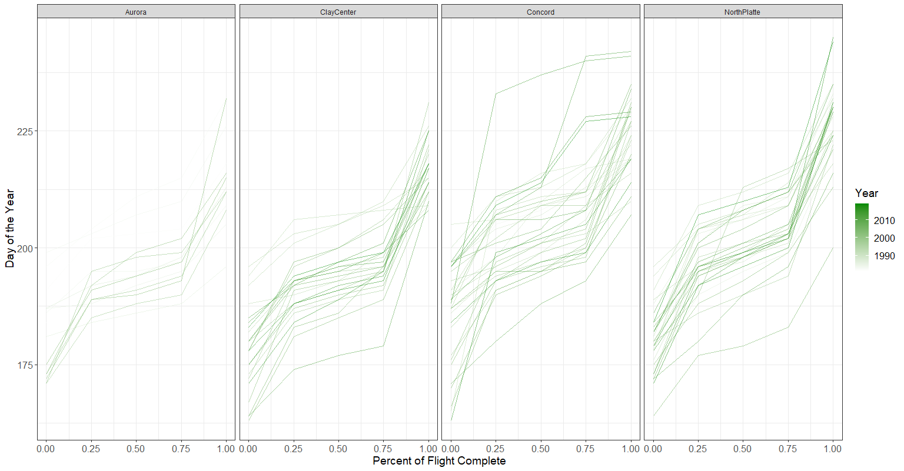

```{r, include = F, eval = T}
knitr::opts_chunk$set(echo=F, dpi=300, eval = T)
options(htmltools.dir.version = FALSE)
library(knitr)
library(emo)
library(dplyr)
library(tidyr)
library(lavaan)
library(readr)
library(ggplot2)
library(plotly)
library(lavaanPlot)
library(semPlot)
wbcDat_LGC <- read_csv("wbcDat_LGC.csv")
wbcDat_LGC$Site <- as.factor(wbcDat_LGC$Site)
```

class:primary
## Outline

- Motivation

- Ridgeline Plot

- Spaghetti Plot

- Latent Growth Model

- Path Diagram

- Year to Year Change

- Results & Conclusions

---
class: inverse

background-image: url(images/unl.gif)
background-size: 100%
background-position: 50% 50%

---
class:primary
## Data Visualization

.center[

]

---
class:primary
## Data

- Site (Aurora, Clay Center, Concord, North Platte)
- Year (1980 - 2020)
- DOTYfirst - DOTYlast (*Time Component*)
- Covariates
    - Total Moths
    - Peak Moths
    - Peak/Total Moths Ratio
    - Average Temperature (Summer)
    - Total Precipitation (Summer)

---
class:primary
## Spaghetti Plot

.center[

]

---
class:primary
## Latent Growth Model

```{r lgm, eval = T, echo = T, warning = F, message = F}
lgcMod <- 'Start =~  1*DOTYfirst + 1*DOTY25pct + 1*DOTY50pct + 1*DOTY75pct + 1*DOTYlast
           Length =~ 0*DOTYfirst +   DOTY25pct +   DOTY50pct +   DOTY75pct + 1*DOTYlast 
             
           DOTYfirst ~~ c(rA, rCC, rC, rNP)*DOTYfirst
           DOTY25pct ~~ c(rA, rCC, rC, rNP)*DOTY25pct
           DOTY50pct ~~ c(rA, rCC, rC, rNP)*DOTY50pct
           DOTY75pct ~~ c(rA, rCC, rC, rNP)*DOTY75pct
           DOTYlast  ~~ c(rA, rCC, rC, rNP)*DOTYlast
             
           DOTYfirst ~ 0*1; DOTY25pct ~ 0*1; DOTY50pct ~ 0*1; DOTY75pct ~ 0*1; DOTYlast  ~ 0*1
           Start  ~ c(iiA, iiCC, iiC, iiNP)*1
           Length ~ c(isA, isCC, isC, isNP)*1
           Start ~~ 0*Length
                         
           Start  ~ avgTemp + totalPrecipitation + totalMoths + peakMoths + peak_totalMoths
           Length ~ avgTemp + totalPrecipitation + totalMoths + peakMoths + peak_totalMoths
          '
```

---
class:primary
## Latent Growth Fit `r emo::ji("deadpan")`

```{r lgcFit, eval = T, echo = T, message = F, warning=F}
lgcFit <- cfa(lgcMod, 
              data = wbcDat_LGC, 
              std.lv = F,
              group = "Site",
              check.gradient = FALSE)
```

```{r fitMeasures, eval=T, echo=F, message=FALSE, warning=FALSE}
t(fitmeasures(lgcFit)[c("chisq", "df", "pvalue","cfi","rmsea","srmr")]) %>%
  as.data.frame() %>%
  kable(format = "html", digits = 3)
```

---
class:primary
## Final Path Diagram

```{r pathDiagram, message=FALSE, warning=FALSE, fig.width = 8, fig.height = 5}
semPaths(lgcFit, 
                  as.expression = c("nodes"), 
                  "std",
                  sizeMan = 8, 
                  sizeInt = 2, 
                  sizeLat = 10, 
                  label.prop = 0.9, 
                  curve = 0.5, 
                  curvePivot = FALSE, 
                  bg = "white", 
                  intercepts = F, 
                  borders = TRUE, 
                  label.norm = "O", 
                  edge.label.cex = 1, 
                  nDigits = 2, 
                  layout = "tree",
                  fade = T, 
                  residuals = F,
                  exoCov = F,
                  combineGroups = T,
                  reorder = FALSE,
                  title = F
)
```


---
class:primary
## Results

```{r results, eval = T, echo = F}
lvmeans <- parameterEstimates(lgcFit, standardized=TRUE) %>% 
  filter(op == "~1", lhs %in% c("Start", "Length"), est != 0) %>% 
  mutate(Group = ifelse(group == 1, "Aurora",                          
                        ifelse(group == 2, "ClayCenter",                                
                               ifelse(group == 3, "Concord", "NorthPlatte")))) %>%
  mutate(stars = ifelse(pvalue < .001, "***", 
                        ifelse(pvalue < .01, "**", 
                               ifelse(pvalue < .05, "*", "")))) %>%
  select(Group, LV=lhs, Est=est, SE=se, Z=z, "Std. Est"=std.all, Sig=stars) %>%
  arrange(desc(LV))

lvmeans %>%
  kable(format = "html", digits = 2, caption = "Latent Means")
```

---
class:primary
## Results

```{r lvvariances, eval = T, echo = F}
lvariances <- parameterEstimates(lgcFit, standardized=TRUE) %>% 
  filter(op == "~~", lhs %in% c("Start", "Length"), est != 0) %>% 
  mutate(Group = ifelse(group == 1, "Aurora",                          
                        ifelse(group == 2, "ClayCenter",                                
                               ifelse(group == 3, "Concord", "NorthPlatte")))) %>%
  mutate(stars = ifelse(pvalue < .001, "***", 
                        ifelse(pvalue < .01, "**", 
                               ifelse(pvalue < .05, "*", "")))) %>%
  select(Group, LV=lhs, Est=est, SE=se, Z=z, "Std. Est"=std.all, Sig=stars) %>%
  arrange(desc(LV))

lvariances %>%
  kable(format = "html", digits = 2, caption = "Latent Variances")
```

---
class:primary
## Year to Year Change

```{r preds, echo = F, eval = T, message = F, warning = F, fig.height = 4.5, fig.width = 8}
preds <- predict(lgcFit)
# predDat <- as.data.frame(cbind(Site = as.character(modDat$Site), Year = modDat$Year, preds))
predDat <- as.data.frame(cbind(Site = as.character(modDat$Site), Year = modDat$Year, rbind(preds$Aurora, preds$ClayCenter, preds$Concord, preds$NorthPlatte)))
numericCols <- c("Start", "Length")
predDat[,numericCols] <- lapply(predDat[,numericCols], as.numeric)
predDat$Year <- as.numeric(as.character(predDat$Year))

predDat %>%
  pivot_longer(cols = c("Start", "Length"), names_to = "LV", values_to = "Pred") %>%
  mutate(LV = factor(LV, levels = c("Start", "Length"))) %>%
ggplot(aes(x = Year, y = Pred)) +
  geom_point() +
  geom_smooth(method = "loess", span = 0.3, se = T) +
  # geom_line() +
  facet_grid(LV~Site) +
  theme_bw() +
  scale_x_continuous(limits = c(1980, 2020), breaks = seq(1980, 2020, 5)) 
  #+ scale_y_continuous(limits = c(-50, 150), breaks = seq(-50, 150, 50))
```

---
class:primary
## Conclusions

- The flight does not follow a linear relationship, most of the moths are captured in the middle of the flight with a few stragglers at the beginning and end.
- Based on the latent means:
  - Concord and North Platte tend to have later start dates.
  - Aurora has a shorter flight and Clay Center tends to have a longer flight.
- Based on the latent variances:
  - North Platte tends to have a more variable start date.
- The total moths for that flight are negatively associated with the start date and positively associated to the length of the flight.
- The peak moths are positively associated with the start date and for some locations, negatively associated with the length.
- According to farmers, the flight in North Platte has been lasting later in the season, based on the time series plot, we can see that the start date has been later and the length of the flight has been increasing over the most recent years.
---
class:primary
count: false
## References & Acknowledgements

- Da Luz, P. M. C., Swoboda Bhattarai, K. A., Montezano, D. G., Hunt, T. E., Write, R. J., & Peterson, J. A. (n.d.).
- Scouting and Treating Western Bean Cutworm. (2019, July 22). Retrieved from https://cropwatch.unl.edu/scouting-and-treating-western-bean-cutworm
- Western Bean Cutworm. (n.d.). Retrieved from https://cropwatch.unl.edu/tags/western-bean-cutworm
- Thank you to all of the people involved in collecting data in different locations over a period of more than thirty years.
